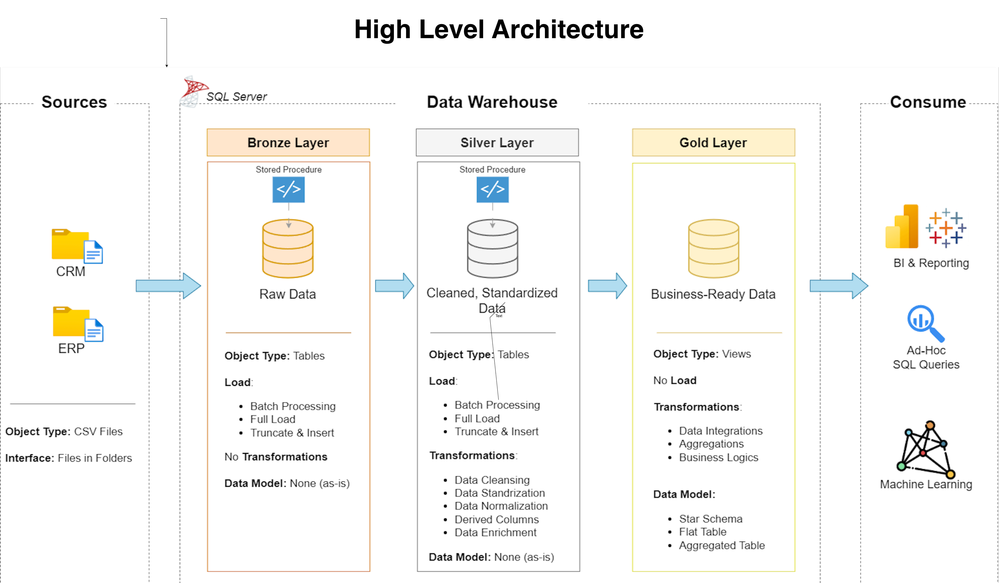

# SQL Data Warehouse Project

## End-to-End Data Warehouse and ETL Pipeline using SQL Server

<p align="center">
  
</p>

A complete end-to-end **SQL Server Data Warehouse project** built using a **Medallion Architecture** with Bronze, Silver, and Gold layers.

This project demonstrates how raw CRM and ERP data can be ingested, cleaned, standardized, integrated, validated, and transformed into a business-ready analytical data model using **T-SQL and SQL Server**.

The final Gold layer follows a **Star Schema** designed for analytical queries, reporting, and business intelligence.

---

# 📌 Table of Contents

- [Project Overview](#-project-overview)
- [Business Problem](#-business-problem)
- [Project Objectives](#-project-objectives)
- [Architecture](#-architecture)
- [Data Flow](#-data-flow)
- [Data Integration](#-data-integration)
- [ETL Pipeline](#-etl-pipeline)
- [Data Warehouse Layers](#-data-warehouse-layers)
- [Bronze Layer](#-bronze-layer)
- [Silver Layer](#-silver-layer)
- [Gold Layer](#-gold-layer)
- [Data Model](#-data-model)
- [Data Quality](#-data-quality)
- [Data Catalog](#-data-catalog)
- [Naming Conventions](#-naming-conventions)
- [Repository Structure](#-repository-structure)
- [Technology Stack](#-technology-stack)
- [How to Run the Project](#-how-to-run-the-project)
- [Key SQL Concepts](#-key-sql-concepts)
- [Key Learning Outcomes](#-key-learning-outcomes)
- [Future Enhancements](#-future-enhancements)
- [Project Status](#-project-status)
- [Author](#-author)

---

# 📊 Project Overview

This project builds a centralized data warehouse from two source systems:

- **CRM — Customer Relationship Management**
- **ERP — Enterprise Resource Planning**

The source data is provided as CSV files and contains information related to:

- Customers
- Products
- Sales transactions
- Customer demographics
- Customer locations
- Product categories

The data passes through three warehouse layers:

```text
                 ┌──────────────────┐
                 │   CRM CSV Files  │
                 └────────┬─────────┘
                          │
                          │
                 ┌────────▼─────────┐
                 │   ERP CSV Files  │
                 └────────┬─────────┘
                          │
                          ▼
                 ┌──────────────────┐
                 │  BRONZE LAYER    │
                 │   Raw Data       │
                 └────────┬─────────┘
                          │
                          ▼
                 ┌──────────────────┐
                 │  SILVER LAYER    │
                 │ Cleaned &        │
                 │ Standardized     │
                 │ Data             │
                 └────────┬─────────┘
                          │
                          ▼
                 ┌──────────────────┐
                 │   GOLD LAYER     │
                 │ Business-Ready   │
                 │ Analytical Data  │
                 └────────┬─────────┘
                          │
             ┌────────────┼────────────┐
             ▼            ▼            ▼
          BI / Reports   SQL        Analytics
