# 🏗️ SQL Data Warehouse & Analytics Engineering Project

<p align="center">

  

</p>

<h3 align="center">
From Raw CRM & ERP Data → Clean Data → Integrated Data → Business-Ready Analytics
</h3>

<p align="center">

  

  

  

  

  

</p>

---

## 📌 What is this project?

This project implements an **end-to-end SQL Server Data Warehouse** that transforms raw operational data from **CRM and ERP source systems** into a clean, integrated, and business-ready analytical model.

The project is designed around a **Bronze → Silver → Gold architecture**, where each layer has a clearly defined responsibility.

```text
                ┌─────────────────────────┐
                │       SOURCE SYSTEMS    │
                │                         │
                │   CRM CSV Files         │
                │   ERP CSV Files         │
                └────────────┬────────────┘
                             │
                             ▼
                ┌─────────────────────────┐
                │      🥉 BRONZE          │
                │                         │
                │      Raw Data           │
                │      Full Load          │
                │      No Transformation  │
                └────────────┬────────────┘
                             │
                             ▼
                ┌─────────────────────────┐
                │      🥈 SILVER          │
                │                         │
                │      Cleaned            │
                │      Standardized       │
                │      Normalized         │
                │      Enriched           │
                │      Integrated         │
                └────────────┬────────────┘
                             │
                             ▼
                ┌─────────────────────────┐
                │       🥇 GOLD           │
                │                         │
                │      Business Logic     │
                │      Dimensions         │
                │      Fact Table         │
                │      Star Schema        │
                └────────────┬────────────┘
                             │
                             ▼
                ┌─────────────────────────┐
                │    ANALYTICS LAYER      │
                │                         │
                │ BI • SQL • Reporting    │
                └─────────────────────────┘
```

---

# 🎯 Project at a Glance

| Area | Implementation |
|---|---|
| Database | SQL Server |
| Language | T-SQL |
| Architecture | Medallion Architecture |
| Source Systems | CRM + ERP |
| Source Format | CSV |
| Bronze | Raw ingestion tables |
| Silver | Cleaned & standardized tables |
| Gold | Analytical SQL Views |
| Data Model | Star Schema |
| ETL | Stored Procedures |
| Ingestion | `BULK INSERT` |
| Transformation | T-SQL |
| Data Quality | SQL validation scripts |
| Documentation | Architecture + Data Catalog + Data Lineage |
| Version Control | Git + GitHub |

---

# 🧭 Table of Contents

- [The Problem](#-the-problem)
- [Project Goals](#-project-goals)
- [Architecture](#-architecture)
- [Data Journey](#-data-journey)
- [Source Systems](#-source-systems)
- [Bronze Layer](#-bronze-layer)
- [Silver Layer](#-silver-layer)
- [Gold Layer](#-gold-layer)
- [Star Schema](#-star-schema)
- [Data Integration](#-data-integration)
- [ETL Pipeline](#-etl-pipeline)
- [Data Quality Framework](#-data-quality-framework)
- [Business Rules](#-business-rules)
- [Data Lineage](#-data-lineage)
- [Project Documentation](#-project-documentation)
- [Repository Structure](#-repository-structure)
- [How to Run](#-how-to-run)
- [Key Engineering Concepts](#-key-engineering-concepts)
- [What This Project Demonstrates](#-what-this-project-demonstrates)
- [Future Enhancements](#-future-enhancements)
- [Author](#-author)

---

# ❓ The Problem

Business data rarely lives in one perfectly structured database.

In this project, customer, product, sales, demographic, location, and product-category information is distributed across two different source systems:

```text
                    BUSINESS DATA
                         │
              ┌──────────┴──────────┐
              │                     │
             CRM                   ERP
              │                     │
       Customer Data         Customer Details
       Product Data          Customer Location
       Sales Data            Product Categories
```

The source datasets contain issues such as:

- Duplicate records
- Missing values
- Invalid dates
- Inconsistent categorical values
- Unwanted spaces
- Hidden characters
- Different customer identifiers
- Different representations of gender
- Inconsistent country codes
- Invalid sales calculations
- Historical product records

Simply loading this data into a reporting layer would create unreliable analytics.

Therefore, the project introduces a structured data engineering pipeline.

---

# 🎯 Project Goals

The primary goal is to build a reliable analytical data warehouse capable of converting raw operational data into business-ready information.

### The project focuses on:

- 📥 Raw data ingestion
- 🧹 Data cleansing
- 🔄 Data transformation
- 🔗 Cross-system integration
- 📐 Data modeling
- 🧪 Data quality validation
- 🏷️ Standardization
- 🧮 Business rule implementation
- ⭐ Analytical modeling
- 📚 Data documentation

---

# 🏛️ Architecture

The warehouse follows a **Medallion Architecture**.

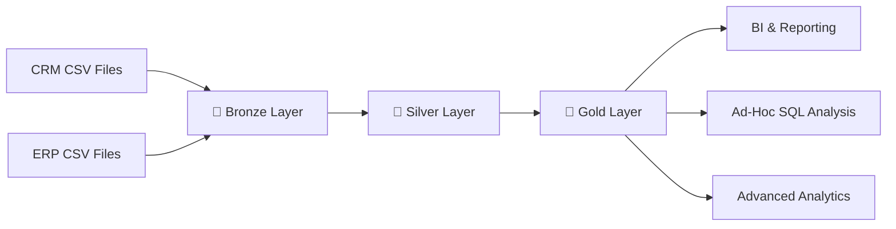

---

## Why three layers?

Each layer solves a different problem.

| Layer | Main Responsibility | Data State |
|---|---|---|
| 🥉 Bronze | Ingestion | Raw |
| 🥈 Silver | Transformation | Cleaned |
| 🥇 Gold | Consumption | Business-ready |

This separation provides:

- Better traceability
- Easier debugging
- Clear transformation boundaries
- Better maintainability
- Easier testing
- Reusable ETL logic

---

# 🔄 Data Journey

The entire project can be understood as a journey:

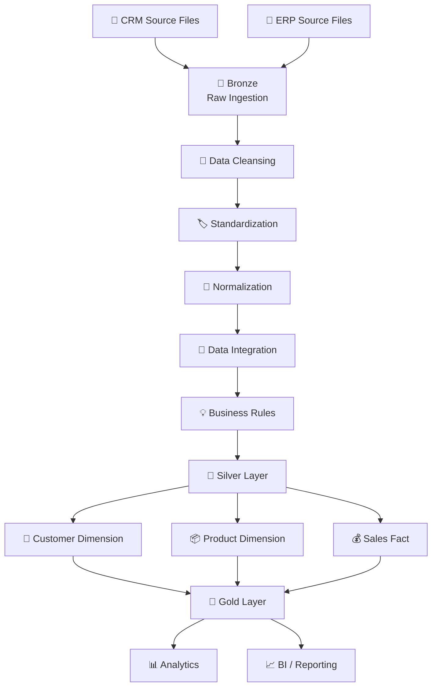

---

# 📂 Source Systems

The warehouse consumes data from two source systems.

---

## 🔵 CRM — Customer Relationship Management

CRM provides:

### Customer Information

```text
cust_info.csv
```

Contains information such as:

- Customer ID
- Customer key
- First name
- Last name
- Gender
- Marital status
- Creation date

### Product Information

```text
prd_info.csv
```

Contains:

- Product ID
- Product key
- Product name
- Product cost
- Product line
- Product start/end dates

### Sales Information

```text
sales_details.csv
```

Contains:

- Sales order number
- Product key
- Customer ID
- Order date
- Shipping date
- Due date
- Sales
- Quantity
- Price

---

# 🟡 ERP — Enterprise Resource Planning

ERP provides complementary information.

### Customer Details

```text
CUST_AZ12.csv
```

Provides:

- Customer ID
- Birthdate
- Gender

### Customer Location

```text
LOC_A101.csv
```

Provides:

- Customer ID
- Country

### Product Categories

```text
PX_CAT_G1V2.csv
```

Provides:

- Category ID
- Category
- Subcategory
- Maintenance

---

# 🥉 Bronze Layer

The Bronze layer is the **landing zone** of the warehouse.

Its responsibility is simple:

> **Get the source data into SQL Server while preserving the original structure as much as possible.**

---

## Bronze Design

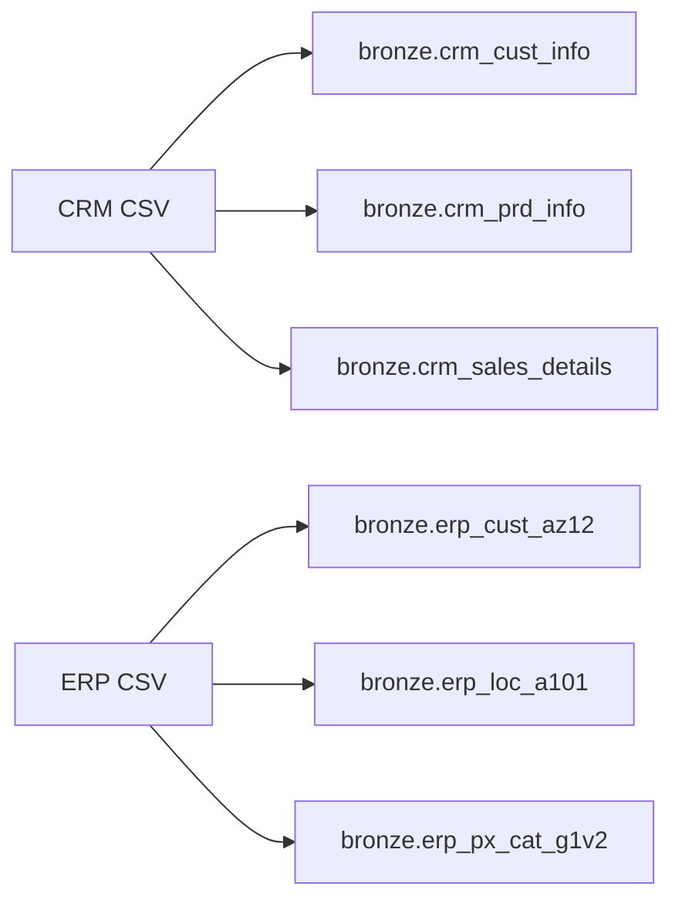

---

## Bronze Tables

### CRM

```text
bronze.crm_cust_info
bronze.crm_prd_info
bronze.crm_sales_details
```

### ERP

```text
bronze.erp_cust_az12
bronze.erp_loc_a101
bronze.erp_px_cat_g1v2
```

---

## Bronze Loading Strategy

The Bronze layer uses a **full-load strategy**:

```text
TRUNCATE TABLE
       ↓
BULK INSERT
       ↓
Raw Data Loaded
```

The process is encapsulated inside:

```sql
EXEC bronze.load_bronze;
```

---

## Why no transformation in Bronze?

Because the Bronze layer acts as a raw landing layer.

Keeping source data close to its original form makes it easier to:

- Trace errors
- Reprocess data
- Compare source vs transformed data
- Debug ETL problems
- Understand source-system structure

---

# 🥈 Silver Layer

The Silver layer is where the actual data engineering work happens.

This is the **quality and transformation layer**.

```text
Bronze
   │
   ├── Remove duplicates
   ├── Handle NULLs
   ├── Clean strings
   ├── Standardize categories
   ├── Normalize dates
   ├── Validate business rules
   ├── Integrate CRM + ERP
   └── Create derived attributes
   │
   ▼
Silver
```

---

# 🧹 Silver Transformation Framework

The transformations can be grouped into six major categories.

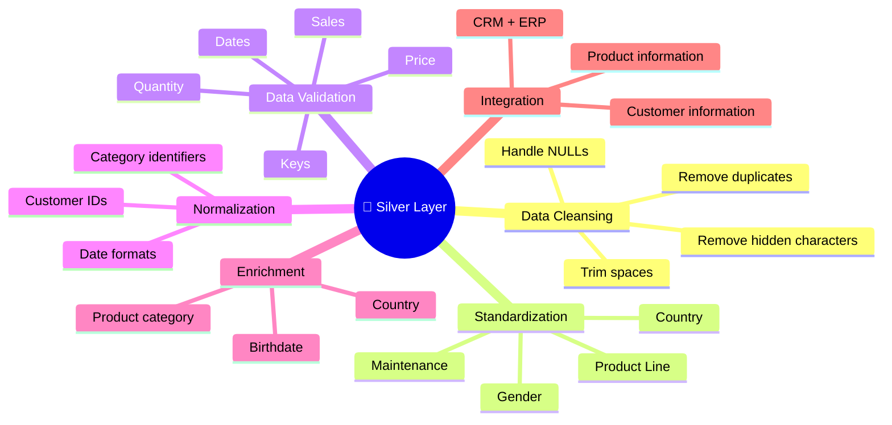

---

# 🧼 Customer Cleansing

The CRM customer dataset is validated for:

### Duplicate / NULL Customer IDs

```sql
SELECT
    cst_id,
    COUNT(*)
FROM bronze.crm_cust_info
GROUP BY cst_id
HAVING COUNT(*) > 1
    OR cst_id IS NULL;
```

Expected result:

```text
No Results
```

---

## Unwanted Spaces

Customer names are checked for leading/trailing spaces.

```sql
WHERE cst_firstname != TRIM(cst_firstname)
```

---

## Gender Standardization

Customer gender values are standardized into:

```text
Male
Female
n/a
```

CRM gender is treated as the primary source where a valid value exists.

---

# 📦 Product Transformation

Product transformations include:

- Product key validation
- Product name cleansing
- Cost validation
- Product line standardization
- Category ID extraction
- Date validation
- Historical record handling

---

## Historical Product Records

Product history is handled using:

```sql
LEAD(prd_start_dt)
OVER (
    PARTITION BY prd_key
    ORDER BY prd_start_dt
)
```

This allows the warehouse to derive product validity periods.

The Gold product dimension then keeps the current version:

```sql
WHERE prd_end_dt IS NULL
```

---

# 💰 Sales Transformation

Sales data receives additional validation because it contains measures used directly for business analysis.

---

## Date Validation

The pipeline checks:

- Invalid dates
- Impossible dates
- Dates outside expected ranges
- Incorrect order/shipping relationships
- Incorrect order/due-date relationships

Example:

```sql
WHERE sls_order_dt > sls_ship_dt
   OR sls_order_dt > sls_due_dt
```

---

# 🧮 Sales Consistency

A fundamental business rule is:

```text
                 SALES
                   =
             QUANTITY × PRICE
```

The pipeline validates this relationship.

```sql
sls_sales != sls_quantity * sls_price
```

Invalid values can be derived using the other available measures.

---

# 👤 ERP Customer Transformation

ERP customer identifiers may contain an unwanted prefix.

For example:

```text
NAS12345
```

is normalized to:

```text
12345
```

This allows CRM and ERP customer records to be integrated correctly.

---

## Birthdate Validation

Birthdates are checked for:

- Unrealistically old dates
- Future dates
- Invalid values

Example:

```sql
WHERE bdate < '1924-01-01'
   OR bdate > GETDATE()
```

---

# 🌍 Country Standardization

Location data is standardized.

```text
DE       → Germany
US       → United States
USA      → United States
NULL     → n/a
```

This prevents the same country from appearing under multiple labels.

---

# 🛠️ Product Category Standardization

Maintenance values are normalized:

```text
YES → Yes
NO  → No
```

Unexpected values are converted to:

```text
n/a
```

Hidden characters such as:

```text
CHAR(13)
CHAR(10)
CHAR(9)
```

are also removed.

---

# 🥇 Gold Layer

The Gold layer represents the **business-facing analytical model**.

Unlike Bronze and Silver, the Gold layer is implemented using **SQL Views**.

```text
Silver Tables
      │
      ├──────────────┐
      │              │
      ▼              ▼
Customer Data     Product Data
      │              │
      └──────┬───────┘
             │
             ▼
        Business Logic
             │
             ▼
        Gold Views
```

The Gold layer contains:

```text
gold.dim_customers
gold.dim_products
gold.fact_sales
```

---

# ⭐ Star Schema

The final warehouse uses a **Star Schema**.

<p align="center">
  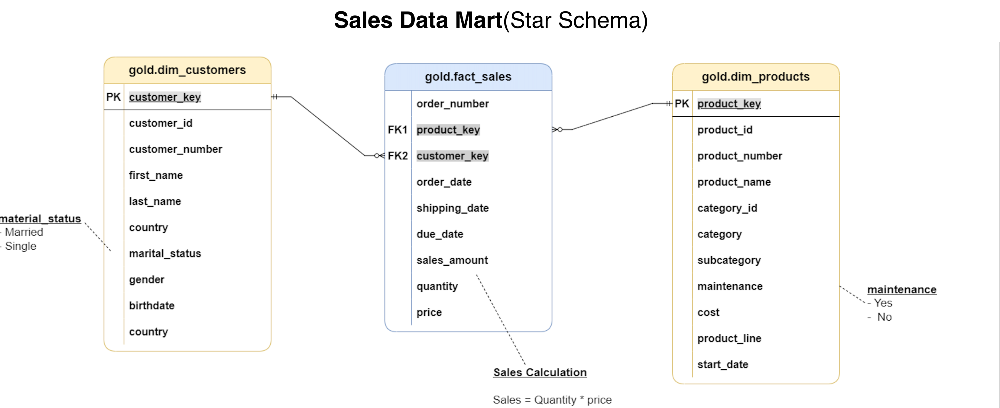
</p>

---

## Star Schema Structure

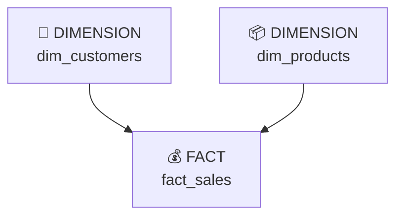

The fact table sits at the center.

The dimensions provide descriptive context.

---

# 👥 `gold.dim_customers`

The customer dimension combines CRM and ERP information.

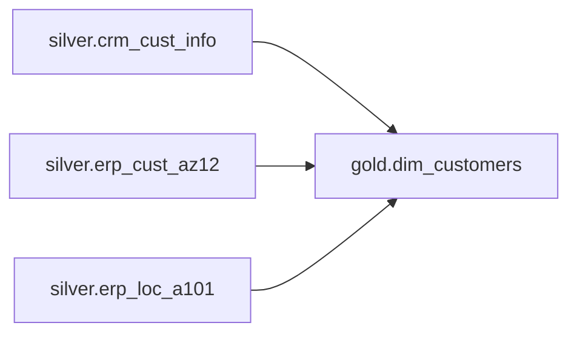

---

## Customer Dimension Fields

| Column | Meaning |
|---|---|
| `customer_key` | Surrogate key |
| `customer_id` | Customer ID |
| `customer_number` | Customer business identifier |
| `first_name` | First name |
| `last_name` | Last name |
| `country` | Customer country |
| `marital_status` | Marital status |
| `gender` | Standardized gender |
| `birthdate` | Date of birth |
| `create_date` | Customer creation date |

---

## Gender Business Rule

CRM is treated as the master source.

```sql
CASE
    WHEN ci.cst_gndr != 'n/a'
        THEN ci.cst_gndr
    ELSE COALESCE(ca.gen, 'n/a')
END
```

This means:

```text
Valid CRM Gender
       ↓
Use CRM

CRM = n/a
       ↓
Use ERP

Both unavailable
       ↓
n/a
```

---

# 📦 `gold.dim_products`

The product dimension combines:

```text
silver.crm_prd_info
        +
silver.erp_px_cat_g1v2
```

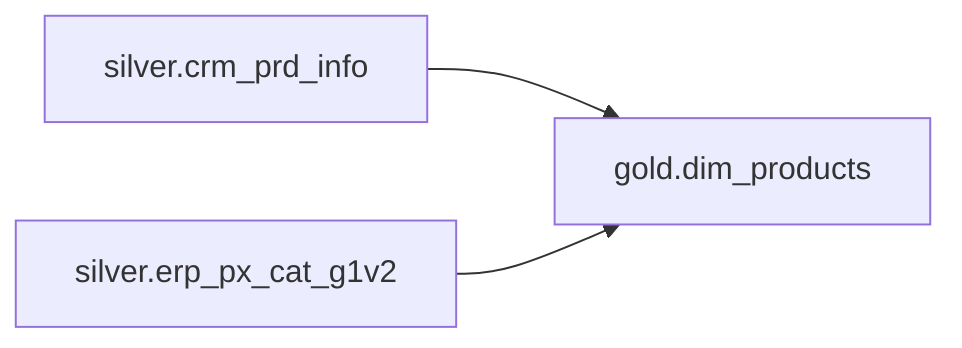

---

## Product Dimension Fields

| Column | Meaning |
|---|---|
| `product_key` | Surrogate key |
| `product_id` | Product ID |
| `product_number` | Product business identifier |
| `product_name` | Product name |
| `category_id` | Category ID |
| `category` | Category |
| `subcategory` | Subcategory |
| `maintenance` | Maintenance requirement |
| `cost` | Product cost |
| `product_line` | Product line |
| `start_date` | Product start date |

Historical product versions are excluded from the Gold dimension.

```sql
WHERE prd_end_dt IS NULL
```

---

# 💵 `gold.fact_sales`

The sales fact table is created by integrating sales transactions with the two analytical dimensions.

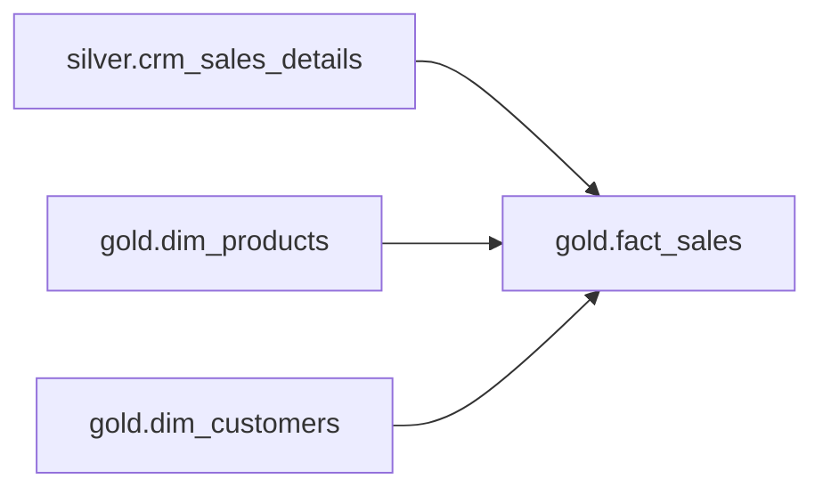

---

## Fact Table Fields

| Column | Type of Attribute |
|---|---|
| `order_number` | Transaction identifier |
| `product_key` | Foreign key |
| `customer_key` | Foreign key |
| `order_date` | Date |
| `shipping_date` | Date |
| `due_date` | Date |
| `sales_amount` | Measure |
| `quantity` | Measure |
| `price` | Measure |

---

# 🔗 Data Integration

One of the most important aspects of this project is integrating information across systems.

The relationship structure is:

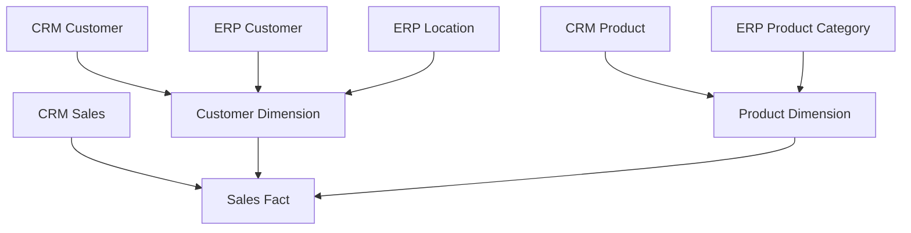

---

# 🧬 Data Lineage

The complete lineage is:

<p align="center">
  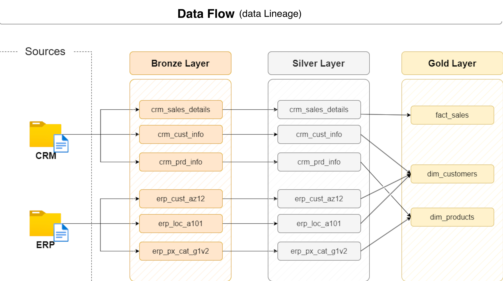
</p>

---

## Customer Lineage

```text
CRM cust_info ──────────────┐
                            ├──> dim_customers
ERP CUST_AZ12 ──────────────┤
                            │
ERP LOC_A101 ───────────────┘
```

---

## Product Lineage

```text
CRM prd_info ───────────────┐
                            ├──> dim_products
ERP PX_CAT_G1V2 ────────────┘
```

---

## Sales Lineage

```text
CRM sales_details
        │
        ├───────────────┐
        ▼               ▼
dim_customers      dim_products
        │               │
        └───────┬───────┘
                ▼
           fact_sales
```

---

# ⚙️ ETL Pipeline

The ETL process is orchestrated through stored procedures.

<p align="center">
  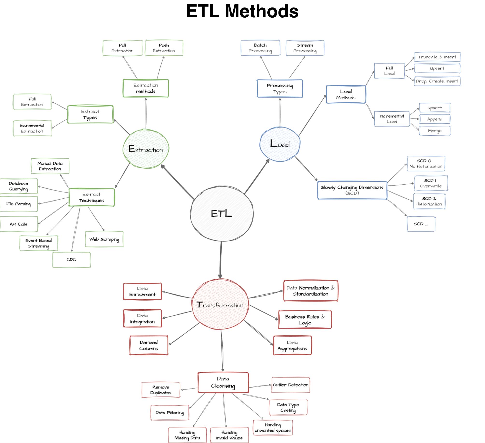
</p>

---

# 🥉 Bronze ETL

```sql
EXEC bronze.load_bronze;
```

The procedure:

1. Starts the batch.
2. Truncates Bronze tables.
3. Loads CSV files using `BULK INSERT`.
4. Captures execution duration.
5. Reports row information.
6. Handles errors using `TRY...CATCH`.

---

# 🥈 Silver ETL

```sql
EXEC silver.load_silver;
```

The procedure:

1. Truncates Silver tables.
2. Reads data from Bronze.
3. Applies transformations.
4. Cleans source data.
5. Standardizes values.
6. Integrates CRM and ERP information.
7. Inserts the result into Silver.
8. Reports row counts.
9. Reports step execution time.

---

# 🧪 Data Quality Framework

Data quality is treated as a separate engineering concern.

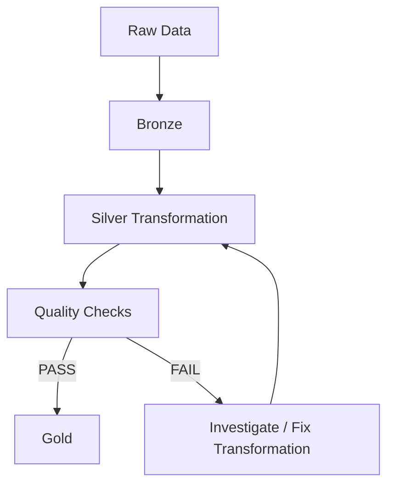

---

# 🔍 Silver Quality Checks

The Silver validation scripts cover:

### 🔑 Key Validation

- NULL keys
- Duplicate keys

### 🧹 String Validation

- Leading spaces
- Trailing spaces
- Hidden characters

### 🏷️ Standardization

- Gender
- Country
- Maintenance
- Product line

### 📅 Date Validation

- Invalid dates
- Future dates
- Date ordering

### 🧮 Numerical Validation

- Negative costs
- Invalid prices
- Invalid sales
- Quantity/price inconsistencies

---

# 🔐 Gold Quality Checks

Gold validation focuses heavily on analytical integrity.

One important check is **foreign key integrity**.

```sql
SELECT *
FROM gold.fact_sales f
LEFT JOIN gold.dim_customers c
    ON c.customer_key = f.customer_key
LEFT JOIN gold.dim_products p
    ON p.product_key = f.product_key
WHERE p.product_key IS NULL;
```

Expected:

```text
No Results
```

This verifies that fact records correctly map to their product dimension.

---

# 📊 Validation Snapshot

The latest successful Silver load produced:

| Silver Table | Rows Loaded |
|---|---:|
| `crm_cust_info` | 18,485 |
| `crm_prd_info` | 397 |
| `crm_sales_details` | 60,398 |
| `erp_cust_az12` | 18,483 |
| `erp_loc_a101` | 18,484 |
| `erp_px_cat_g1v2` | 37 |
| **TOTAL** | **116,284** |

This demonstrates that the pipeline is processing data successfully through the Silver layer.

---

# 🧠 Engineering Decisions

Several design decisions were intentionally made in this project.

---

## Why Bronze contains raw data?

To preserve source-system fidelity and improve traceability.

---

## Why Silver contains transformations?

Because this is the appropriate layer for:

- Cleansing
- Standardization
- Normalization
- Enrichment
- Integration

---

## Why Gold uses Views?

The Gold layer is primarily designed as a business-facing analytical layer.

Views allow the model to expose business-ready data without maintaining another physical copy of the transformed data.

---

## Why Star Schema?

A Star Schema simplifies analytical querying.

Instead of requiring analysts to understand multiple operational source tables, they can query:

```text
dim_customers
dim_products
fact_sales
```

---

# 📚 Documentation

The repository contains dedicated documentation supporting the implementation.

---

## 🏛️ Data Architecture

`docs/data_architecture.png`

<p align="center">
  
</p>

---

## 🔄 Data Flow

`docs/data_flow.png`

<p align="center">
  
</p>

---

## 🔗 Data Integration

`docs/data_integration.png`

<p align="center">
  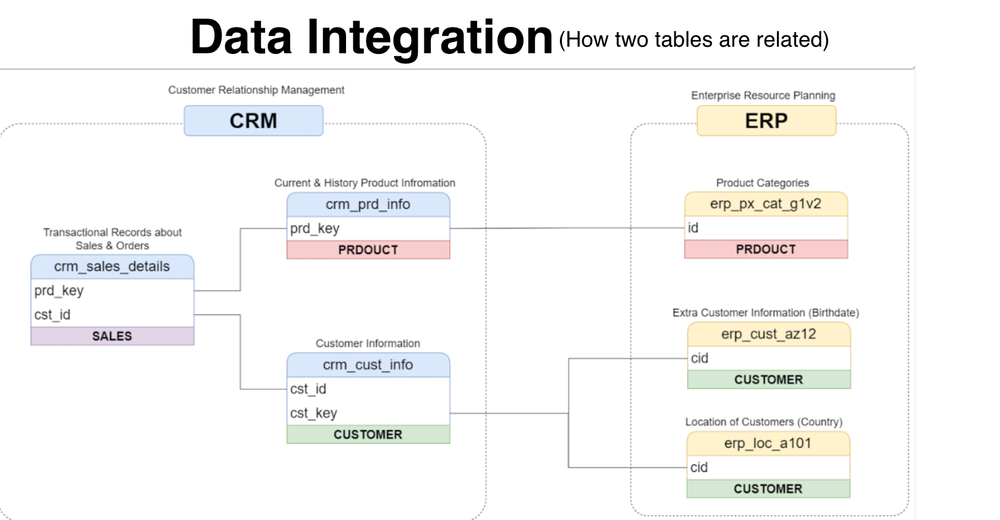
</p>

---

## ⭐ Data Model

`docs/data_model.png`

<p align="center">
  
</p>

---

## 🔧 ETL Methods

`docs/ETL_methods.png`

<p align="center">
  
</p>

---

## 📖 Data Layers

Detailed explanation of the Bronze, Silver, and Gold layers:

```text
docs/data_layers.pdf
```

---

## 📋 Data Catalog

The project includes a dedicated data catalog:

```text
docs/data_catalog.md
```

The catalog documents the analytical objects and their attributes.

---

## 🏷️ Naming Conventions

The project follows documented naming conventions:

```text
docs/naming_conventions.md
```

---

# 📁 Repository Structure

```text
sql-data-warehouse-project/
│
├── 📁 datasets/
│   ├── 📁 source_crm/
│   │   ├── cust_info.csv
│   │   ├── prd_info.csv
│   │   └── sales_details.csv
│   │
│   └── 📁 source_erp/
│       ├── CUST_AZ12.csv
│       ├── LOC_A101.csv
│       └── PX_CAT_G1V2.csv
│
├── 📁 docs/
│   ├── data_architecture.png
│   ├── data_catalog.md
│   ├── data_flow.png
│   ├── data_integration.png
│   ├── data_layers.pdf
│   ├── data_model.png
│   ├── ETL_methods.png
│   └── naming_conventions.md
│
├── 📁 scripts/
│   │
│   ├── 📁 bronze/
│   │   └── proc_load_bronze.sql
│   │
│   ├── 📁 silver/
│   │   ├── ddl_silver.sql
│   │   └── proc_load_silver.sql
│   │
│   └── 📁 gold/
│       └── ddl_gold.sql
│
├── 📁 tests/
│   ├── quality_checks_silver.sql
│   └── quality_checks_gold.sql
│
├── init_database.sql
│
└── README.md
```

---

# 🚀 How to Run the Project

## 1️⃣ Clone the repository

```bash
git clone https://github.com/Gyanvi908/sql-data-warehouse-project.git
```

```bash
cd sql-data-warehouse-project
```

---

## 2️⃣ Initialize the database

Run:

```text
init_database.sql
```

This initializes the required database structure.

---

## 3️⃣ Create Bronze Objects

Run:

```text
scripts/bronze/
```

Create the Bronze tables and stored procedure.

---

## 4️⃣ Load Bronze

Execute:

```sql
EXEC bronze.load_bronze;
```

Verify:

```sql
SELECT COUNT(*) FROM bronze.crm_cust_info;
SELECT COUNT(*) FROM bronze.crm_prd_info;
SELECT COUNT(*) FROM bronze.crm_sales_details;

SELECT COUNT(*) FROM bronze.erp_cust_az12;
SELECT COUNT(*) FROM bronze.erp_loc_a101;
SELECT COUNT(*) FROM bronze.erp_px_cat_g1v2;
```

---

## 5️⃣ Create Silver Objects

Run:

```text
scripts/silver/ddl_silver.sql
```

and:

```text
scripts/silver/proc_load_silver.sql
```

---

## 6️⃣ Load Silver

Execute:

```sql
EXEC silver.load_silver;
```

---

## 7️⃣ Run Silver Quality Checks

Execute:

```text
tests/quality_checks_silver.sql
```

The validation queries should return no records where the expectation is:

```text
No Results
```

---

## 8️⃣ Create Gold Layer

Execute:

```text
scripts/gold/ddl_gold.sql
```

This creates:

```text
gold.dim_customers
gold.dim_products
gold.fact_sales
```

---

## 9️⃣ Validate Gold

Execute:

```text
tests/quality_checks_gold.sql
```

---

# 🔎 Example Analytical Queries

Once the Gold layer has been created, business users can query the warehouse without understanding the underlying CRM and ERP systems.

---

## Total Sales

```sql
SELECT
    SUM(sales_amount) AS total_sales
FROM gold.fact_sales;
```

---

## Sales by Country

```sql
SELECT
    c.country,
    SUM(f.sales_amount) AS total_sales
FROM gold.fact_sales f
JOIN gold.dim_customers c
    ON f.customer_key = c.customer_key
GROUP BY c.country
ORDER BY total_sales DESC;
```

---

## Sales by Product Category

```sql
SELECT
    p.category,
    SUM(f.sales_amount) AS total_sales
FROM gold.fact_sales f
JOIN gold.dim_products p
    ON f.product_key = p.product_key
GROUP BY p.category
ORDER BY total_sales DESC;
```

---

## Top Customers

```sql
SELECT TOP 10
    c.customer_number,
    c.first_name,
    c.last_name,
    SUM(f.sales_amount) AS total_sales
FROM gold.fact_sales f
JOIN gold.dim_customers c
    ON f.customer_key = c.customer_key
GROUP BY
    c.customer_number,
    c.first_name,
    c.last_name
ORDER BY total_sales DESC;
```

---

# 🧰 Technology Stack

```text
SQL Server
    │
    ├── T-SQL
    ├── Stored Procedures
    ├── Views
    ├── BULK INSERT
    ├── Window Functions
    └── Data Quality Checks

Development
    │
    ├── SQL Client / SSMS
    ├── Git
    └── GitHub

Documentation
    │
    ├── Draw.io
    ├── Markdown
    └── PDF
```

---

# 🧩 Key SQL Concepts Used

This project applies practical SQL Server concepts including:

### Data Loading

```sql
BULK INSERT
```

### Stored Procedures

```sql
CREATE OR ALTER PROCEDURE
```

### Views

```sql
CREATE VIEW
```

### Window Functions

```sql
ROW_NUMBER()
LEAD()
```

### Conditional Logic

```sql
CASE
```

### NULL Handling

```sql
COALESCE()
ISNULL()
NULLIF()
```

### String Transformation

```sql
TRIM()
REPLACE()
SUBSTRING()
UPPER()
```

### Date Transformation

```sql
CONVERT()
CAST()
```

### Data Integration

```sql
INNER JOIN
LEFT JOIN
```

### Data Validation

```sql
GROUP BY
HAVING
WHERE
```

---

# 📐 Data Warehouse Design Principles

The project follows several important data engineering principles.

### 1. Separation of Concerns

Each layer has a defined purpose.

```text
Bronze → Ingestion
Silver → Transformation
Gold   → Consumption
```

### 2. Source Traceability

Raw data remains available in Bronze.

### 3. Reusable ETL

Stored procedures encapsulate loading logic.

### 4. Data Quality First

Validation is performed before data reaches the analytical layer.

### 5. Business-Friendly Modeling

The Gold layer hides source-system complexity.

### 6. Documentation

Architecture, lineage, data model, catalog, and naming conventions are documented.

---

# 📊 What Can Be Built on Top of This Warehouse?

The Gold layer provides a strong foundation for downstream analytics.

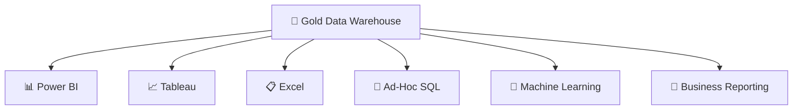

Potential analytical areas include:

### Customer Analytics

- Customer segmentation
- Customer value
- Geographic analysis
- Demographic analysis

### Product Analytics

- Product performance
- Category performance
- Product cost analysis
- Product-line analysis

### Sales Analytics

- Revenue trends
- Top products
- Top customers
- Country-level performance
- Sales volume
- Average order value

---

# 📈 From Data Warehouse to Analytics

The architecture intentionally separates **data engineering** from **data consumption**.

```text
             DATA ENGINEERING
                    │
                    ▼
        ┌──────────────────────┐
        │    Data Warehouse    │
        │                      │
        │ Bronze → Silver      │
        │           → Gold     │
        └───────────┬──────────┘
                    │
                    ▼
             DATA CONSUMPTION
                    │
        ┌───────────┼───────────┐
        ▼           ▼           ▼
      BI          SQL          ML
   Reporting    Analytics    Models
```

This makes the warehouse reusable for multiple downstream applications.

---

# 🧪 Testing Philosophy

The project does not treat data quality as an afterthought.

Instead:

```text
Source
  ↓
Load
  ↓
Transform
  ↓
Validate
  ↓
Publish
```

Validation is used to detect:

- Duplicate keys
- Missing keys
- Invalid dates
- Invalid relationships
- Unexpected categorical values
- Invalid calculations
- Referential integrity problems

---

# 🔮 Future Enhancements

The current project implements a complete foundational Data Warehouse.

Possible next steps include:

---

## ⚡ Incremental Loading

Replace full-load processing with incremental loading.

```text
Source
   │
   ▼
Detect New / Changed Records
   │
   ▼
Incremental Processing
   │
   ▼
Warehouse
```

Potential strategies:

- Watermark columns
- Change Data Capture
- Change Tracking
- MERGE
- Upsert logic

---

## 🕰️ Slowly Changing Dimensions

Implement:

```text
SCD Type 0
SCD Type 1
SCD Type 2
```

especially for customer attributes such as:

- Country
- Marital status
- Customer profile information

---

## 🤖 Pipeline Automation

The current process can later be orchestrated using:

- SQL Server Agent
- Apache Airflow
- Azure Data Factory
- GitHub Actions

---

## 📋 ETL Audit Framework

A production version could maintain:

```text
etl_batch_log
etl_table_log
etl_error_log
```

capturing:

- Batch ID
- Start time
- End time
- Table name
- Rows inserted
- Status
- Error message

---

## 📊 BI Dashboard

A Power BI semantic model can be built on top of:

```text
gold.fact_sales
gold.dim_customers
gold.dim_products
```

---

# 🏁 Project Completion Checklist

| Component | Status |
|---|:---:|
| Database initialization | ✅ |
| CRM source ingestion | ✅ |
| ERP source ingestion | ✅ |
| Bronze tables | ✅ |
| Bronze ETL procedure | ✅ |
| Silver tables | ✅ |
| Silver ETL procedure | ✅ |
| Data cleansing | ✅ |
| Data standardization | ✅ |
| Data normalization | ✅ |
| Data enrichment | ✅ |
| CRM/ERP integration | ✅ |
| Silver quality checks | ✅ |
| Gold customer dimension | ✅ |
| Gold product dimension | ✅ |
| Gold sales fact | ✅ |
| Star schema | ✅ |
| Gold quality checks | ✅ |
| Data catalog | ✅ |
| Data architecture | ✅ |
| Data lineage | ✅ |
| Data model documentation | ✅ |
| ETL documentation | ✅ |
| Naming conventions | ✅ |
| GitHub repository | ✅ |

---

# 💡 Why this project matters

This project goes beyond simply writing SQL queries.

It demonstrates how a Data Engineer approaches a real data problem:

```text
                 BUSINESS PROBLEM
                       │
                       ▼
                 SOURCE SYSTEMS
                       │
                       ▼
                  DATA INGESTION
                       │
                       ▼
                  RAW DATA
                       │
                       ▼
                DATA QUALITY ISSUES
                       │
                       ▼
                  TRANSFORMATION
                       │
                       ▼
                  DATA INTEGRATION
                       │
                       ▼
                  DATA MODELING
                       │
                       ▼
                 BUSINESS LOGIC
                       │
                       ▼
                 ANALYTICAL DATA
                       │
                       ▼
              REPORTING / ANALYTICS
```

The resulting warehouse provides a clean foundation for analytical workloads while maintaining clear lineage back to the original CRM and ERP sources.

---

# 👤 Author

## Gyanvi

**Data Analytics • Data Science • Data Engineering**

<p align="left">

<a href="https://github.com/Gyanvi908">

</a>

</p>

---

# ⭐ Final Takeaway

> **Raw data is not analytics. The real value comes from transforming, validating, integrating, and modeling that data so that it can reliably answer business questions.**

This project demonstrates that complete journey:

```text
CRM + ERP
    ↓
Raw Data
    ↓
🥉 Bronze
    ↓
Cleaning + Standardization
    ↓
🥈 Silver
    ↓
Integration + Business Logic
    ↓
🥇 Gold
    ↓
Star Schema
    ↓
Analytics
```

---

<p align="center">

### 🚀 Built with SQL Server • T-SQL • Data Engineering • Git

</p>
